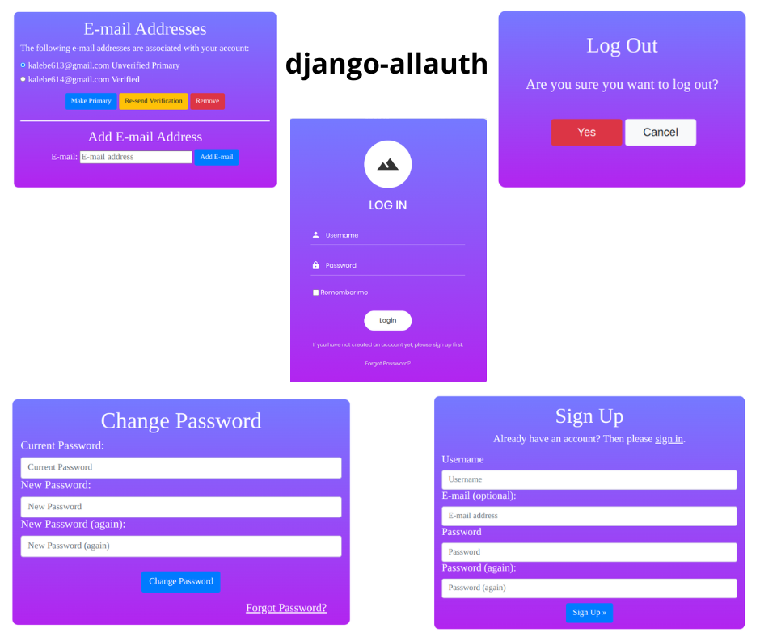

# <p align="center">User Authentication and Account Management with [django-allauth]</p>

[django-allauth]: https://django-allauth.readthedocs.io/en/latest/

[django]: https://docs.djangoproject.com/en/4.2/

[python]: https://docs.python.org/3/

[html]: https://developer.mozilla.org/en-US/docs/Web/HTML

[css]: https://developer.mozilla.org/en-US/docs/Web/CSS

[javascript]: https://developer.mozilla.org/en-US/docs/Web/JavaScript

[bootstrap]: https://getbootstrap.com/

[my_github]: https://github.com/Kalebe614

#### <p align="center">This project is a comprehensive user authentication application developed with [Django][django] and utilizing the [django-allauth] library. With this solution, users can register new accounts. The key features include:

- User Registration: Allow new users to create accounts by providing basic information.
- User Authentication: Enable login and authentication for registered users.
- Email Change: Allow users to change their email address associated with the account.
- Password Change: Provide functionality for users to change their account password to maintain security.
- Password Recovery: Offer an option for users to recover their password in case they forget it.
- Logout: Allow users to securely log out of their accounts.</p>





## Contents

- [Technologies Used](#technologies-used)

- [Installation](#installation)

- [Credits](#credits)

- [Contact](#contact)

## Technologies Used

- [Python][python]
- [Django][django]
- [HTML][html]
- [CSS][css]
- [Javascript][javascript]
- [Bootstrap][bootstrap]

## Installation

<p>1. Clone the repository:

```
git clone https://github.com/Kalebe614/django-login-allauth.git
```

</p>

<p>
2. Navigate to the project directory:

```
cd django-login-allauth
```
</p> 
 
<p>
3. Install the dependencies:

```
pip install -r requirements.txt
```
</p>
<p>
4. Run the database migrations:

```
python manage.py migrate
```
</p>
<p>
5. Execute the project:

```
python manage.py runserver
```
</p>
<p>
Now you can open: http://localhost:8000 or http://127.0.0.1:8000 to view it in the browser.
</p>

## Credits
CRUD app was built by [Kalebe de Oliveira][my_github]

## Contact
- Email: <a ref="mailto:kalebe613@gmail.com">kalebe613@gmail.com</a>
- [GitHub](https://github.com/Kalebe614)

